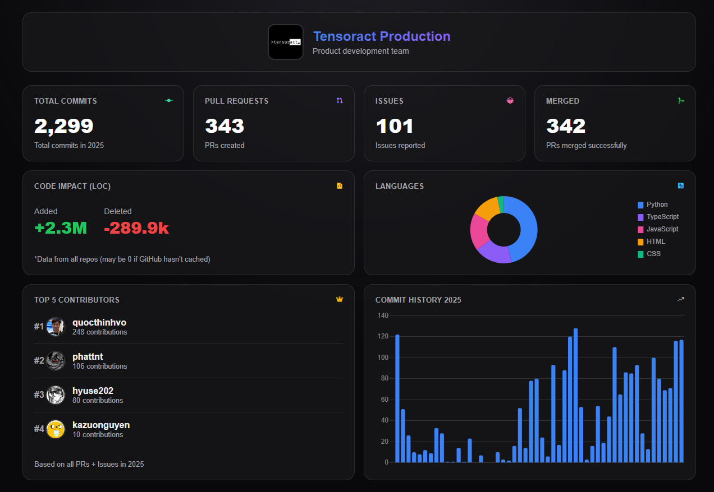

# GitHub Org Wrapped

A simple web tool to generate yearly statistics for any GitHub organization — commits, PRs, issues, top contributors, and more.

## Features

- 📊 Total commits, PRs, issues, and merged PRs count
- 📈 Weekly commit activity chart
- 🏆 Top 5 contributors
- 💻 Lines of code added/deleted
- 🌐 Language breakdown
- 📅 Customizable year (2020-2025)
- 📥 Download results as PNG image

## Usage

1. Open `index.html` in your browser
2. Enter your **GitHub Organization name** (e.g., `google`, `microsoft`)
3. Enter your **GitHub Personal Access Token**
4. Select the **year** you want to analyze
5. Click **Start Analysis** and wait 1-3 minutes
6. Download the result as an image if needed

## GitHub Token

You need a GitHub Personal Access Token with these scopes:
- `repo` (read access to repositories)
- `read:org` (read organization info)

**Create a token:** [GitHub Settings → Developer settings → Personal access tokens](https://github.com/settings/tokens)

## Notes

- Analysis may take 1-3 minutes depending on the number of repositories
- LOC data may show 0 if GitHub hasn't cached the statistics yet
- Top contributors are based on PRs and Issues created (max 1000 due to API limits)

## Tech Stack

- Vanilla HTML/CSS/JavaScript
- [Chart.js](https://www.chartjs.org/) for charts
- [Phosphor Icons](https://phosphoricons.com/) for icons
- [html2canvas](https://html2canvas.hertzen.com/) for image export

## License

MIT
